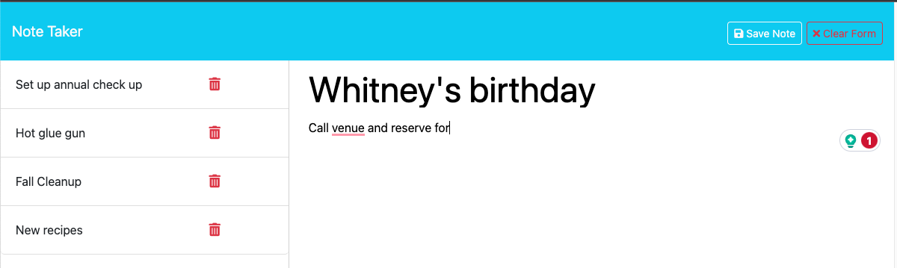
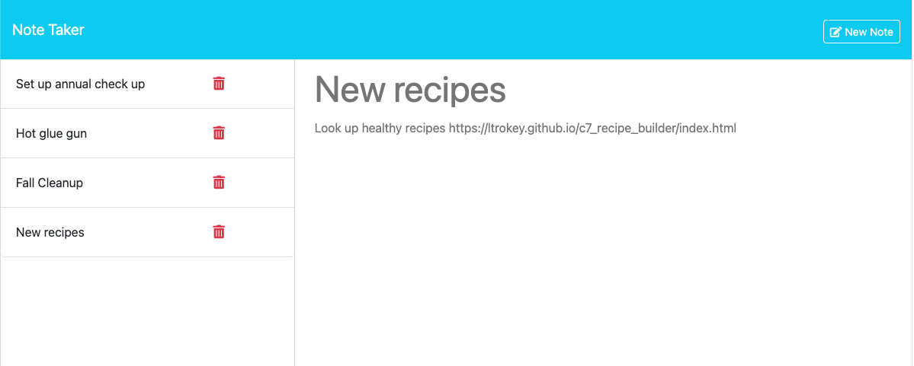

# Note Taker

[](https://opensource.org/licenses/MIT)

[Link to live deploy](https://c11-note-taker-app-47ae648d4538.herokuapp.com/)

## Description
This application is a note-taking web tool built with the help of provided front-end starter code. The front end provides an intuitive interface for creating, viewing, and managing notes. On the back end, the server is powered by Express.js and Node.js, allowing for seamless communication between the client and the server. To uniquely identify each note, the npm package 'uuid' was employed, ensuring that every note is assigned a distinct identifier. The back end is structured in a modularized fashion, making the code organized and maintainable. It features GET, POST, and DELETE routes to retrieve, create, and delete notes, providing a well-rounded and functional note-taking experience.

## Table of Contents
- [Installation](#installation)
- [Usage](#usage)
- [Collaborators](#collaborators)
- [Badges](#badges)
- [Features](#features)
- [Tests](#tests)
- [Questions](#questions)

## Installation

To get started with this note-taking application, ensure you have the following prerequisites installed:

- [Node.js](https://nodejs.org/) and [npm](https://www.npmjs.com/) for running JavaScript applications.

Follow these steps to install and run the application:

1. **Clone the Repository:**

   Clone this repository to your local machine using Git. Open your terminal or command prompt and run the following command:

   ```bash
   git clone https://github.com/yourusername/your-repo.git

2. Install Dependencies:

    Navigate to the project directory and install the necessary dependencies using npm. Run the following commands:

    ```
    cd your-repo

    npm i
    npm i uuid
    *** npm install -g nodemon
    ```

    *** Nodemon is a utility that monitors for changes in your source code and automatically restarts the server. It's a handy tool for development.

3. Start the Server:

    To start the application, run the following command:

    ```
    npm start
    *** nodemon server.js
    ```
4. Open the Application:

    Once the server is running, open your web browser and go to http://localhost:3001 to access the note-taking application.

    ```
    Please replace `"yourusername/your-repo"` with the actual URL of your repository, and adjust any other details as needed for your specific project.
    ```
## Usage

Using this note-taking application is straightforward and user-friendly. Here are the essential steps to make the most of its features:

1. **Access the Application:**

   - Ensure you have completed the installation steps outlined in the [Installation](#installation) section of this README.

   - Open your web browser and navigate to [http://localhost:3001](http://localhost:3001) to access the note-taking application.

2. **View Existing Notes:**

   - Upon launching the application, you'll see a list of previously created notes in the left column. Each note is displayed with its title.

   - To view the content of a specific note, click on the note title. The note's details will appear on the right side of the screen.

3. **Create a New Note:**

   - To create a new note, click the "New Note" button located on the top-right corner of the application. This action will clear the note fields for you to enter your new note.

   - Enter a title and the text of your note. Once you've added your content, click the "Save" button to store the note.

     

4. **View and Manage Notes:**

   - All your saved notes are listed on the left column. To view a note, simply click on its title.

   - To delete a note, click the red trash icon (🗑️) next to the note you wish to remove and the note will be permanently deleted.

        

5. **Enjoy Organized Note-Taking:**

   - Use this application to conveniently jot down and access your notes, thoughts, and ideas. The left column stores your notes for quick and easy reference.

## Badges


## Backend Features

The backend of this note-taking application, developed using Express.js and Node.js, offers several essential features and robust error handling mechanisms:

### 1. RESTful API

- The backend exposes a RESTful API that allows the front end to perform standard CRUD (Create, Read, Update, Delete) operations on notes.

### 2. Data Storage

- The application stores note data in a JSON file, ensuring data persistence across server restarts.

### 3. Error Handling

- **Comprehensive Error Handling:** The backend features comprehensive error handling to ensure the reliability and robustness of the application.

- **Error Status Codes:** Different error scenarios, such as invalid requests or file read/write errors, are handled with appropriate HTTP status codes, providing clear feedback to the front end.

- **Custom Error Messages:** Custom error messages are provided for various error conditions to aid in debugging and user-friendly error reporting.

- **Error Responses:** Errors are properly handled and responded to, ensuring that both users and developers receive meaningful error messages in response to any issues.

- **404 Not Found:** When a request is made for a resource that doesn't exist, the backend returns a 404 Not Found status code with a descriptive error message.

- **500 Internal Server Error:** In the case of unexpected server errors, the backend responds with a 500 Internal Server Error status code, along with relevant error information.

### 4. Modular Structure

- The backend code is organized in a modularized fashion, promoting maintainability and ease of development.

### 5. API Routes

- The backend includes well-defined API routes for retrieving, creating, and deleting notes, ensuring clear separation of concerns and easy expansion of functionality.

The backend of this note-taking application is designed with a focus on data integrity, security, and robust error handling, providing a reliable foundation for the overall application.


## Questions
[GitHub Profile](https://github.com/ltrokey)

Please feel free to contact me via the email link below.

[Email](mailto:trokeyln@gmail.com)
